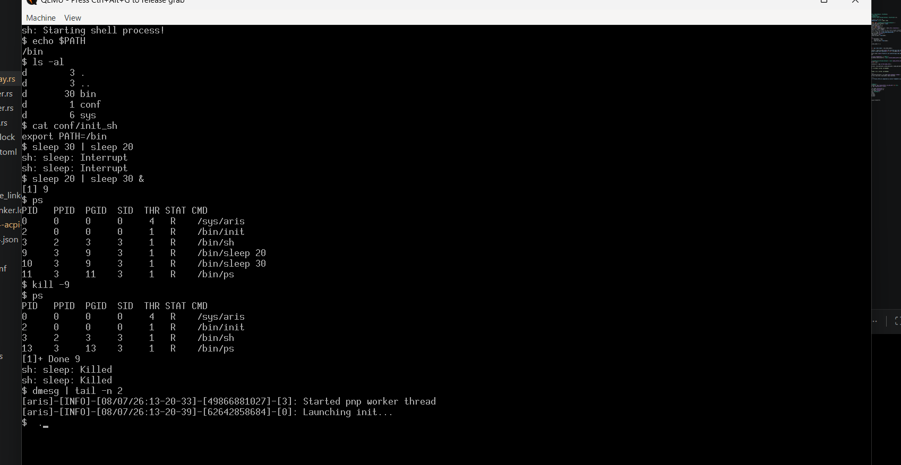

# ARCHIS
ARCHIS is targeted to be a cross-platform multi-arch supporting Rust based OS.

## Description
Current plan is to support x86_64 architecture for intel/amd chipsets which translates to UEFI platform for most modern machines.

## Prerequisites
The build has been tested on Windows, WSL and Ubuntu, and for now, it works 
Tools required
* rust (rustc-nightly == 1.98.0)
* docker (only required for windows)
* make
* llvm toolchain (specifically clang + llvm-ar)
* coreutils
* gdisk, dosfstools, parted, udev (additional packages to install (for image build process) if you're on linux distro)

If you're on windows, easiest option is to download MSYS2, and use pacman (MSYS2 default package manager) to download the required tools and use coreutils. Make sure to add the usr/bin folder to system path (MSYS2 by default doesn't add that to system path)

## Build
To build the OS, run following from project root
>make

This will build debug version of kernel, bootloader, drivers and the disk image 
If you want release version, simply invoke
>make CONFIG=release

## Status
The initial set of goals that I had for this project has now been completed. It starts with a simple shell that can execute processes. Understands foreground process groups, signals, pipe, redirection, job control, filesystem etc. To know more about 
this, please refer to [archis-blog](https://rohitrtdev.github.io/os-blog/index.html) 

| Boot screen | Shell |
|:--------:|:--------:|
|  |  |

Userspace utilities cannot use floating point operations right now, the scheduler doesn't save floating point state as part of the thread context yet.

## Testing 
Testing can be done by burning the image file to a flash drive (tools like rufus or balena etcher should be fine) and running it on real machine by choosing to boot through the flash drive in BIOS setup.
Make sure that you have disabled secure boot in the BIOS setup or the OS won't load.

The image file can also be loaded in qemu and run.
Download qemu for your platform and simply invoke
>make test

We also have provision to run unit tests, this is primarily for development purposes.
>make run_unit_test

These tests are run on host OS, which means they are designed to only test logical functionality (Like allocator/loader working) and not meant for hardware testing,
which still requires simulation

